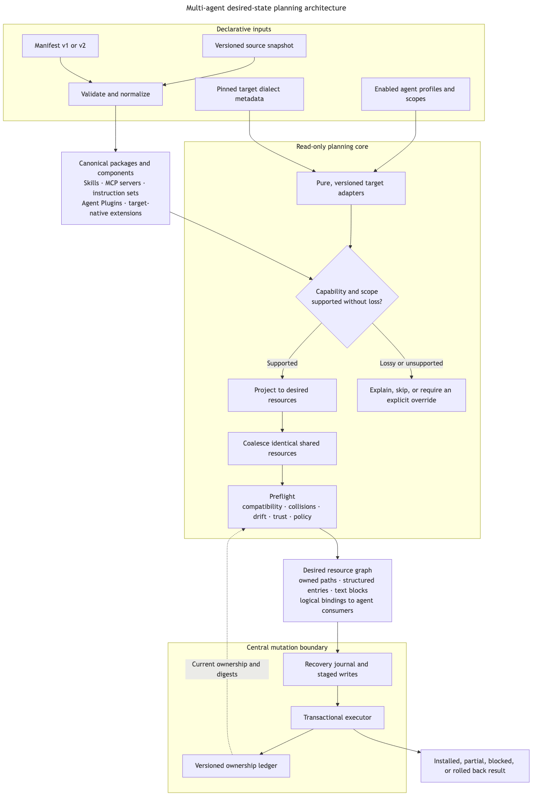

# Multi-Agent Configuration Architecture Plan

**Status:** Historical — portable components are now skills and MCP only; Agent Plugin copies and instruction sets were removed.<br>
**Date:** 2026-08-14<br>
**Scope:** Architecture and delivery plan only; this document does not authorize implementation.

## Executive decision

Skill Manager should evolve from an explicit path copier with client-specific plugin side effects into a desired-state manager for agent configuration.

The proposal's central insight is correct: content concepts and agent targets are separate axes. The important refinement is that adapters must be pure planners, not independent installers. They should translate a validated source component into a declarative resource plan; one central engine must perform conflict detection, staging, rollback, ownership tracking, and recovery for every target.

The intended flow is:

1. A source publishes versioned packages and components.
2. A user enables the agent profiles they use.
3. Version-aware target adapters report whether each component is native, losslessly translatable, lossy, unsupported, or blocked.
4. Adapters produce desired resources without mutating the machine.
5. The core coalesces identical resources shared by several agents.
6. A global preflight checks compatibility, collisions, local drift, trust, and policy.
7. One transactional executor applies the complete plan and records every owned resource and logical consumer.

This structure makes new agents and new concepts independently understandable without pretending the translation work between them disappears.

## Critique of the initial proposal

### What is directionally right

- Separating concept kinds from agent targets is the right antidote to scattered `if cursor` and `if codex` branches.
- Treating plugins as packages containing components is better than treating every plugin as one homogeneous capability.
- Generalizing ownership beyond a single path is required for shared JSON and TOML configuration.
- User-selected agents should drive installation. A source repository should not need to know which tools a particular user has enabled.
- Exact name collisions and local edits can be detected mechanically; semantic contradictions in prose cannot be reliably proven in the first version.

### What must change

1. **Adapters must not own writes.** An `install`/`uninstall` trait lets every adapter invent different safety, rollback, and drift behavior. Adapters should return a plan of typed desired resources. Only the core executor may mutate the filesystem.
2. **`supports(kind) -> bool` is too weak.** Compatibility has at least five states: native, lossless translation, lossy translation, unsupported, and blocked by version or policy. The UI and planner need the reason and any lost semantics.
3. **The fan-out is not always one physical install per agent.** Cursor, Codex, OpenCode, and GitHub Copilot can all discover skills under `~/.agents/skills`. If all four are enabled, one physical directory can satisfy four logical bindings. The planner must coalesce identical resources rather than create collisions with itself.
4. **The N-by-M problem is reduced, not eliminated.** A new concept still needs translators for targets that support it, and a new target still needs mappings for the concepts it supports. Shared standards and reusable projections reduce that work; a registry alone does not.
5. **“Plugin” needs two categories.** Agent Plugins 1.0 is a portable package format for exactly Agent Skills and MCP servers. Cursor, Claude Code, GitHub Copilot, OpenCode, Codex, and Grok Build also have target-native plugin systems with additional components and different execution models. Portable packages may be projected across targets; native extensions must remain explicitly target-qualified.
6. **Rules are not one universal file format.** Some agents read `AGENTS.md`, some use `CLAUDE.md`, some have rule directories and path metadata, and Cursor's documented user rules are managed through its UI rather than a public user-rule file. The canonical model must represent intent and scope, then report unsupported or lossy mappings honestly.
7. **A list of owned units is necessary but not sufficient.** Mutating several paths and shared config entries needs a transaction journal, staged documents, recovery after interruption, and one commit point for the ownership ledger.
8. **Semantic rule conflicts need a bounded contract.** The product can hard-block structural collisions, warn about overlapping rule surfaces, and honor explicit source-declared incompatibilities. It should not claim that an LLM or keyword check can prove two instruction sets are logically compatible.
9. **GitHub Copilot cannot disappear from the migration.** It is already part of the shipped plugin behavior even though it was omitted from the proposed target list. The plan must either preserve it as a first-class target or make deprecation an explicit product decision.

## Current-state findings

The existing architecture has good foundations worth preserving:

- immutable, validated Git snapshots;
- separate manifest normalization;
- a serialized application mutation boundary;
- digest-based local-change protection;
- staged path replacement with rollback;
- source-aware identities and a versioned ledger; and
- a thin IPC/UI boundary.

The extension pressure is visible in the current implementation:

- [`manifest.rs`](src-tauri/src/manifest.rs) still defines manifest v1 as one source path and one explicit destination per install;
- [`catalog_v1.rs`](src-tauri/src/catalog_v1.rs) detects Agent Skills and Agent Plugins but flattens them into boolean flags on one `CatalogItem`;
- [`install_v1.rs`](src-tauri/src/install_v1.rs) contains Cursor and GitHub Copilot paths and performs plugin fan-out inside the generic transaction code;
- [`ledger.rs`](src-tauri/src/ledger.rs) records only the primary destination in ledger version 3;
- Cursor and Copilot plugin copies, plugin data, and the Copilot settings entry are not represented as owned resources;
- plugin fan-out errors are currently ignored, so the ledger can report success after a partial install; and
- uninstall applies plugin cleanup heuristics to any directory record instead of using a recorded component or target identity.

These are immediate correctness gaps, not merely future extensibility concerns. The first implementation phase must close them before adding another agent.

## Product goals

1. Let users select the coding agents they use and the scopes they want Skill Manager to manage.
2. Let one source repository publish portable skills, MCP servers, always-on instructions, and portable Agent Plugin packages.
3. Preserve an escape hatch for generic file/directory installs without confusing those installs with portable agent concepts.
4. Install each supported component into the native or shared location appropriate for every enabled agent.
5. Add a new agent without changing source manifests or the transaction engine.
6. Add a new concept without modifying targets that do not support it.
7. Detect all structural conflicts and local drift before mutation.
8. Make partial support and lossy translation visible before installation.
9. Preserve user-owned content, formatting where practical, and unrelated keys in shared configuration files.
10. Never execute source content during installation.

## Non-goals

- Proving that arbitrary natural-language rules are semantically consistent.
- Silently reverse-engineering undocumented application databases or settings.
- Dynamically downloading executable adapter code. Target adapters should initially ship with Skill Manager.
- Becoming a marketplace, dependency solver, or secrets manager in the first architecture release.
- Making all vendor-native plugin formats portable.
- Auto-enabling hooks, in-process plugins, or background processes without a separate high-risk approval.
- Dropping manifest v1 or existing installations during the migration.

## Current compatibility snapshot

This is a research snapshot, not a timeless support promise. Each target adapter must pin a documented dialect and be reverified against the installed client version during implementation.

| Target             | Skills                                                                                                 | Always-on instructions                                                                                                                                                           | MCP                                                                                      | Plugin implication                                                                                                                                                 |
| ------------------ | ------------------------------------------------------------------------------------------------------ | -------------------------------------------------------------------------------------------------------------------------------------------------------------------------------- | ---------------------------------------------------------------------------------------- | ------------------------------------------------------------------------------------------------------------------------------------------------------------------ |
| Cursor             | Reads user skills from `~/.agents/skills` and `~/.cursor/skills`, among other compatibility locations. | Project `.cursor/rules/*.mdc` and project `AGENTS.md` are documented; user rules are managed in Customize.                                                                       | User and project `mcp.json` are documented.                                              | Natively supports Agent Plugins 1.0 and a richer Cursor Plugin format.                                                                                             |
| Claude Code        | Personal skills use `~/.claude/skills`; plugin skills are namespaced.                                  | User `~/.claude/CLAUDE.md`, project `CLAUDE.md`, and `.claude/rules/*.md` have defined precedence and scope. Claude does not directly treat `AGENTS.md` as its instruction file. | User servers are stored in `~/.claude.json`; project servers use `.mcp.json`.            | Claude's native plugin format uses `.claude-plugin/plugin.json` and can add skills, agents, hooks, MCP, LSP, and monitors. It is not the Agent Plugins 1.0 layout. |
| Codex              | User skills use `~/.agents/skills`; repository skills also use `.agents/skills`.                       | Global instructions use `~/.codex/AGENTS.md` or `AGENTS.override.md`; project instructions are layered by directory.                                                             | User and trusted-project servers use `[mcp_servers.<id>]` tables in Codex `config.toml`. | Plugins can bundle skills and MCP servers, but their installed identity and policy are separate from bare MCP entries.                                             |
| OpenCode           | Current documentation includes native and `.agents`/Claude-compatible skill locations.                 | Global `~/.config/opencode/AGENTS.md`, project `AGENTS.md`, and configured instruction paths are supported.                                                                      | MCP entries live in OpenCode's JSON/JSONC configuration.                                 | OpenCode plugins are in-process JavaScript/TypeScript extensions; the v2 API is explicitly beta. Treat them as target-native executable extensions.                |
| Grok Build         | User and project `.grok/skills` locations are documented, with additional compatibility scanning.      | Project `AGENTS.md` is documented; compatibility behavior is configurable.                                                                                                       | User and project `[mcp_servers]` tables live in `config.toml`.                           | Grok has native plugins and is still evolving quickly; its open-source harness is the most precise compatibility reference.                                        |
| GitHub Copilot CLI | Personal skills can use `~/.agents/skills` or `~/.copilot/skills`.                                     | Instruction sources are discovered separately and have client-defined precedence.                                                                                                | MCP can be managed as a first-class resource.                                            | Copilot has a rich native plugin format and direct-install cache. Current Skill Manager behavior must be migrated, not assumed correct from path shape alone.      |

Two conclusions follow from this table:

- Shared standards provide useful fast paths, especially Agent Skills and Agent Plugins, but they do not erase scope and precedence differences.
- Target support must be versioned by **dialect**, not represented as one permanent set of paths per brand name.

## Proposed domain model

### Source package

A source package is the user-facing installable unit. It carries identity, provenance, display metadata, source digest, and one or more components. A package may be a single skill or a bundle such as an Agent Plugin.

```text
SourcePackage
  canonical_id       source-id/package-id
  provenance         source key, URL, commit, source path
  metadata           name, description, version, risk summary
  components[]       portable components
  native_payloads[]  explicitly target-qualified extensions
  source_digest      digest before target projection
```

### Portable component

Start with three canonical component kinds:

```text
Skill
  directory, name, description, invocation metadata

McpServer
  name, transport, command or URL, args, cwd, environment references,
  headers, and portable timeout/auth metadata

InstructionSet
  name, Markdown body, intended scope, activation mode, optional path globs
```

The first rules release should support `activation = always` only. Keep the activation field extensible so path-scoped or agent-selected rules can be added after their cross-target semantics are defined.

### Package formats

- `agent-plugin@1.0.0` is a recognized portable package format. Preserve and validate the package as a package; also expose its skills and MCP servers as components for targets that require projection.
- Target-native plugins are `NativeExtension { target_id, format, path }`. They are never advertised as portable.
- A legacy `FileTree` package preserves manifest v1's explicit path-copy behavior. It bypasses agent negotiation and remains visibly labeled as a generic install.

### Agent profile and dialect

```text
AgentProfile
  target_id          stable product identity, such as codex or claude-code
  enabled            explicit user choice
  scopes             user and, later, selected projects
  detected_version   optional local client version
  dialect_id         adapter-selected configuration dialect
  policy_overrides   per-target enablement and risk decisions
```

An agent brand is not a dialect. OpenCode v1/v2, a future Codex config revision, or a breaking Grok beta release may require separate dialects under the same stable target ID.

### Capability result

Replace a boolean support check with:

```text
CapabilityResult
  Native
  LosslessTranslation
  LossyTranslation { losses[] }
  Unsupported { reason }
  Blocked { reason, required_action }
```

Lossy and blocked results require user-visible review. Unsupported components are skipped explicitly and do not count as installed.

## Target adapter contract

Adapters are read-only translators:

```rust
trait TargetAdapter {
    fn descriptor(&self) -> TargetDescriptor;
    fn detect(&self, system: &SystemSnapshot) -> DetectionResult;
    fn capabilities(&self, dialect: &DialectId) -> CapabilitySet;
    fn plan(
        &self,
        component: &Component,
        profile: &AgentProfile,
        context: &PlanningContext,
    ) -> Result<TargetPlan, PlanError>;
}
```

An adapter may:

- select native destinations;
- render a target-specific file from canonical content;
- emit a structured config entry;
- preserve an Agent Plugin package for a natively compatible target;
- split a portable package into component projections when that is lossless; and
- explain unsupported fields, scopes, versions, or transports.

An adapter may not write, delete, launch a process, update the ledger, or suppress an error.

Registration should remain compile-time initially. Adding arbitrary executable adapters would turn every source into a code-execution supply-chain surface.

## Desired resource graph

Adapters produce typed desired resources. The initial resource types should be:

```text
OwnedPath
  whole file or directory, installed digest

OwnedStructuredEntry
  document path, JSON/TOML format, semantic key path, value digest

OwnedTextBlock
  document path, stable marker ID, body digest

Binding
  logical package/component/target/scope consumer of a physical resource
```

`OwnedTextBlock` is a last resort for monolithic instruction files. Prefer a whole owned file in a documented rules directory or a documented import/config entry when the target supports one.

The planner must coalesce physical resources:

- identical path and identical bytes become one resource with several target consumers;
- identical structured key and identical value become one resource with several consumers;
- identical identity with different desired content is a hard conflict; and
- removing one target removes only its binding until the last consumer is gone.

This resource graph is the key distinction between logical installs and physical writes.

## Planning and execution pipeline



[Editable Mermaid source](docs/diagrams/multi-agent-architecture.mmd)

### 1. Normalize

- Parse manifest v1 or v2 with a pinned local schema.
- Validate source containment, portability, size, symlinks, names, and component-specific rules.
- Preserve source provenance and partial component errors.
- Never retrieve a schema or execute source content during normalization.

### 2. Resolve profiles and dialects

- Load explicitly enabled agent profiles.
- Detect local client/version only as advisory evidence; detection must not enable an agent silently.
- Select a known dialect or return a conservative compatibility warning.
- Treat an unknown newer client version as read-only until compatibility is confirmed for shared-config mutations.

### 3. Project

- Ask each relevant adapter for a plan.
- Record support level, warnings, required trust, and all desired resources.
- Preserve the package boundary even when components are projected independently.

### 4. Coalesce

- Normalize physical resource identities.
- Merge identical desired resources and accumulate their consumers.
- Retain separate logical bindings for UI status and target disablement.

### 5. Preflight globally

Preflight the complete operation across all configured sources and targets before the first write:

- target/dialect compatibility;
- cross-source and cross-target resource collisions;
- path overlap and symlink safety;
- current ledger ownership;
- digest drift at the exact owned path, key, or block;
- shared-document parse validity;
- explicit package incompatibilities;
- trust tier and required user confirmation; and
- recoverability of every planned mutation.

### 6. Execute centrally

- Acquire the existing application mutation lock.
- Re-read preconditions after the lock is held.
- Stage every new path and every complete rewritten shared document.
- Write a recovery journal before activation.
- Activate resources in a deterministic order.
- Atomically replace the ledger only after all resources succeed.
- Roll back all activated resources on failure.
- Recover or roll back an interrupted journal on next launch.

No adapter-specific error may be ignored. A partial result must be explicit and recoverable, never reported as a successful installation.

## Ownership ledger v4

Ledger v4 should separate logical installations, target bindings, and physical resources.

```text
Installation
  canonical_id, provenance, package digest, component metadata

Binding
  installation_id, component_id, target_id, dialect_id, scope,
  capability result, resource_ids[]

Resource
  resource_id, resource type, physical identity, installed digest,
  consumer binding IDs, adapter/dialect version
```

Required properties:

- a reverse index from physical identity to resource owner;
- exact digest validation for a structured entry or text block rather than hashing an unrelated whole file;
- a whole-document precondition while applying shared-file patches, so unrelated concurrent edits are not overwritten;
- reference counting through consumer bindings;
- retained records for removed-upstream packages;
- explicit migration version and repeatable recovery; and
- enough provenance to explain who owns a path or config key in the UI.

### Migration from ledger v3

1. Migrate each v3 destination to one `OwnedPath` resource and one legacy binding.
2. Classify the record from the stored source snapshot where possible; do not infer plugin status from “directory” alone.
3. Discover current Cursor and Copilot plugin projections only for records proven to be plugins.
4. Adopt an auxiliary resource only when its exact content/value matches the expected projection.
5. If it differs, leave it untouched and create a drift/conflict requiring review.
6. Do not delete any untracked legacy auxiliary path during migration.
7. Keep a backup of ledger v3 until v4 has been written and reread successfully.

## Conflict model

### Hard conflicts

Block installation when:

- two sources want the same target/component name with different content;
- two plans want the same path, structured key, or marker ID with different values;
- owned filesystem roots overlap unsafely;
- an existing resource is unmanaged and differs from the desired value;
- an owned path, key, or block has drifted locally;
- a source declares an explicit incompatibility with an installed package;
- a required target dialect or transport is unsupported; or
- a shared document cannot be parsed and safely rewritten.

### Coalesced matches

Do not report a conflict when several enabled agents resolve to the same physical identity and identical desired content. Record one resource with multiple bindings.

### Rule overlap warnings

Instruction sets should optionally declare topics and explicit `conflictsWith` package IDs. The product may also warn when several always-on instruction sets target the same agent and scope.

These warnings are advisory. Do not block merely because two Markdown files coexist, and do not label an LLM-based comparison as proof of compatibility. The UI should show the effective target precedence and let the user disable one binding.

### Drift handling

Retain the existing conservative policy:

- automatic updates stop on drift;
- uninstall stops on drift unless the user explicitly confirms a backup-first removal;
- replacing unmanaged content requires a preview and persistent backup; and
- changing one managed key does not claim or overwrite unrelated keys in the same file.

## Security and trust model

Configuration types have different activation risk:

| Tier                   | Examples                                                 | Required treatment                                                                                                             |
| ---------------------- | -------------------------------------------------------- | ------------------------------------------------------------------------------------------------------------------------------ |
| 1: Instructions        | Markdown rules without executable assets                 | Show source and target scope.                                                                                                  |
| 2: Agent resources     | Skills containing scripts or templates                   | Show executable files and remind users the agent may invoke them later.                                                        |
| 3: External tools      | stdio or remote MCP servers                              | Show command/URL, arguments, environment-variable names, headers, and network/process implications; require explicit approval. |
| 4: Automatic execution | Hooks, monitors, in-process plugins, background services | Defer initially or require a separate high-risk workflow and target-specific sandbox review.                                   |

Additional rules:

- Sources may reference environment-variable names but must not contain or request persisted secret values.
- Skill Manager does not start MCP servers or run hook/plugin code during installation.
- Installing an enabled MCP or plugin configuration still authorizes a target agent to execute it later, so “not executed during install” is not sufficient disclosure.
- Portable Agent Plugin schemas and supported versions are pinned locally.
- Native plugins are target-qualified and never translated into another target's runtime extension format.

## Manifest evolution

Introduce manifest v2 rather than overloading v1's `installs` entries. A non-final illustrative shape is:

```json
{
  "version": 2,
  "source": { "id": "acme", "name": "Acme agent configuration", "description": "Shared engineering workflows" },
  "packages": [
    {
      "id": "review",
      "components": [
        { "kind": "skill", "path": "skills/review" },
        { "kind": "instructionSet", "path": "rules/review.md", "activation": "always" }
      ]
    },
    { "id": "data-tools", "format": "agent-plugin@1.0.0", "path": "plugins/data-tools" }
  ]
}
```

Before freezing the schema, write an ADR answering:

- whether one package is always the user-facing install unit;
- whether a user may install individual components from a package;
- how package and component IDs are namespaced;
- which portable MCP fields are supported;
- how target-native extensions are declared;
- whether generic file-tree installs remain in v2 or stay v1-only; and
- how explicit package conflicts and dependencies are represented.

Manifest v1 remains readable and behavior-compatible throughout the migration. Its explicit destinations continue to mean generic `FileTree` resources; v1 sources are not silently reinterpreted as multi-agent packages.

## User experience

### Agent settings

Add an **Agents I use** page with one card per target:

- explicit enable/disable control;
- detected installation and version, clearly labeled as detection rather than selection;
- managed scopes;
- selected dialect and compatibility warning;
- supported component summary; and
- planned cleanup preview when disabling a target.

Detection may recommend an agent but must not silently enable it or write configuration.

### Catalog

Show packages as the primary cards. Within a package, show components and a target matrix with statuses such as:

- Ready — native
- Ready — translated
- Review — lossy
- Blocked — conflict or drift
- Unsupported
- Installed
- Update available
- Partially installed

Do not collapse “skipped as unsupported” into success.

### Install preview

Before a consequential install, show:

- targets and scopes;
- files, directories, and config keys to create or update;
- shared resources that satisfy several targets;
- commands, URLs, and environment-variable names for MCP;
- any lossy mappings;
- conflicts and backups; and
- the rollback boundary.

### Conflict review

Give each conflict a deterministic category and recovery choice. For rules, show side-by-side content and effective precedence, but describe semantic overlap as a warning rather than a machine-proven contradiction.

## Delivery plan

Each phase is a coherent, releasable checkpoint. Do not start the next phase until the current phase's invariants and migration evidence pass.

### Phase 0 — Record the pivot and close current plugin safety gaps

**Outcome:** Current Cursor/Copilot plugin support cannot report false success or delete unowned auxiliary content.

- Write the product/architecture ADR for the change from generic/skills-focused installs to multi-agent configuration management.
- Reverify Cursor and GitHub Copilot direct-plugin installation through their supported CLI or documented local-development path.
- Inventory every current auxiliary side effect: canonical package path, Cursor copy, Copilot copy, Copilot settings key, and plugin data path.
- Make every side-effect error visible and fail/roll back the operation.
- Track or conservatively preserve every auxiliary resource.
- Replace directory-based plugin cleanup inference with recorded component identity.
- Add migration fixtures for existing plugin records and modified auxiliary copies.

**Exit criteria:** No successful operation can leave an unreported partial plugin install; uninstall removes only recorded, unchanged resources.

### Phase 1 — Introduce the desired-resource kernel without changing product behavior

**Outcome:** Existing manifest v1 installs and current targets run through one planner and executor.

- Add typed `DesiredResource`, `Binding`, `OperationPlan`, and precondition models.
- Split `install_v1.rs` into read-only planning and centralized execution modules.
- Introduce the recovery journal and multi-resource rollback.
- Implement ledger v4 and the v3 migration.
- Add a global resource index and cross-source collision preflight.
- Re-express generic paths, Cursor plugin projection, and Copilot plugin projection through built-in adapters.
- Preserve existing IPC behavior through a compatibility façade while the UI model is widened.

**Exit criteria:** Existing user-visible behavior is preserved, ledger migration is idempotent, and injected failures at every activation step recover without orphaning or deleting user content.

### Phase 2 — Add agent profiles and versioned adapters

**Outcome:** Users explicitly select targets; support decisions are visible and version-aware.

- Persist enabled agent profiles separately from source state.
- Implement stable target IDs and dialect IDs.
- Add advisory detection for installed clients and versions.
- Add `CapabilityResult` and support-reason serialization through IPC.
- Build the Agents settings UI and install-preview model.
- Define the adapter conformance checklist and fixtures.

**Exit criteria:** Enabling or disabling a target creates a read-only plan first, and an unknown dialect never causes an unreviewed shared-config write.

### Phase 3 — Ship manifest v2 and multi-agent skills

**Outcome:** One portable skill package can be installed for all enabled compatible agents with physical-resource coalescing.

- Finalize the manifest v2 ADR and generated schema.
- Add canonical `SourcePackage` and `Skill` parsing.
- Keep manifest v1 fully compatible.
- Implement skill projections for Cursor, Claude Code, Codex, OpenCode, Grok Build, and GitHub Copilot where current public contracts permit them.
- Prefer the shared `~/.agents/skills` path when it is a documented, lossless choice for all relevant bindings.
- Preserve target-specific naming and invocation semantics in the compatibility report.
- Update source validation, publishing docs, catalog UI, and removal plans.

**Exit criteria:** Selecting several agents never duplicates or self-conflicts on an identical shared skill; disabling one agent retains resources still consumed by another.

### Phase 4 — Add MCP and portable Agent Plugin projection

**Outcome:** Portable MCP definitions and Agent Plugins can be installed safely across supported target dialects.

- Pin and fully validate Agent Plugins 1.0.0 locally.
- Preserve the package for targets with native Agent Plugin support.
- Project skills and MCP entries for targets without native package support only when the mapping is lossless or explicitly approved.
- Implement JSON, JSONC where required, and comment-preserving TOML entry mutators.
- Track each MCP server by semantic key and value digest.
- Add the Tier 3 trust preview and environment-reference policy.
- Add target-specific runtime verification commands that inspect registration without starting arbitrary source executables where possible.

**Exit criteria:** Two sources cannot silently claim the same MCP name, unrelated shared-config fields survive install/update/uninstall, and a failing target rolls back the entire requested transaction.

### Phase 5 — Add always-on instruction sets and conflict review

**Outcome:** Supported user-scoped instructions are installed with explicit precedence and honest conflict handling.

- Finalize the minimal `InstructionSet` contract for always-on content.
- Implement whole-file or documented-directory projections first.
- Use managed text blocks only for targets that require a monolithic file and have no supported import/directory mechanism.
- Mark Cursor user rules unsupported until a documented writable interface exists, or deliver them through a supported package mechanism with clear scope.
- Show target precedence and rule overlap warnings.
- Add explicit `conflictsWith` metadata after the source contract is proven with real examples.

**Exit criteria:** No existing monolithic instructions file is overwritten wholesale; every managed contribution can be removed without disturbing user text or another source's contribution.

### Phase 6 — Evaluate target-native extensions

**Outcome:** A documented decision exists for hooks, native plugins, agents/subagents, LSP servers, and monitors.

- Treat every format as target-qualified.
- Evaluate its execution lifecycle, permissions, signing/trust story, and uninstall contract.
- Add one component family at a time only after the central resource and risk models can represent it.
- Keep in-process plugins and automatic hooks out of the portable component model.

**Exit criteria:** Every supported native extension has a target-specific threat model, versioned dialect, transactional ownership representation, and runtime verification strategy.

## Verification strategy

### Contract tests

- Manifest v1 compatibility and v2 schema fixtures.
- Portable component parsing, including partial component failures.
- Adapter fixture tests for each supported target/dialect pair.
- Golden desired-resource plans for the same package across target combinations.
- Capability-loss explanations and unknown-version behavior.

### Planner tests

- identical shared resources coalesce;
- different content at one identity hard-conflicts;
- cross-source name/key/path collisions are caught globally;
- removing one consumer retains a shared resource;
- unsupported components remain explicit in results; and
- no planning path mutates the filesystem.

### Transaction and migration tests

- injected failure before and after every resource activation;
- crash-recovery journal replay/rollback;
- structured-entry drift versus unrelated document edits;
- text-block drift and marker damage;
- ledger v3 migration, repeated migration, and rollback to backup;
- current Cursor/Copilot plugin auxiliary-resource adoption; and
- modified or unmanaged resources are preserved.

### Runtime compatibility tests

Use disposable homes and, where necessary, disposable repositories for each supported OS and target version. Validate:

- the target actually discovers the skill/rule/plugin;
- the target's own list/inspect command reports the MCP or plugin;
- updates are visible after the documented reload boundary;
- uninstall removes only Skill Manager-owned resources; and
- Windows path, process, JSON/TOML, and line-ending behavior is real rather than inferred from package artifacts.

Static file assertions establish the plan and on-disk state. They do not establish that an agent loaded the configuration.

## Adapter acceptance checklist

A new target is complete only when it has:

- stable target ID and display metadata;
- one or more documented dialect IDs;
- official-source links and a last-verified date;
- version detection with conservative unknown-version behavior;
- capability results for every canonical component kind;
- pure desired-resource projections;
- precedence, naming, scope, and reload semantics documented;
- fixture and golden-plan coverage;
- transaction/drift coverage for each resource type it emits;
- disposable runtime discovery evidence; and
- UI copy for unsupported and lossy cases.

## Decisions required before implementation

Recommended defaults are included so these questions do not block design unnecessarily.

1. **Install unit:** Use a package as the primary user-facing unit; allow component-level overrides later, not in the first v2 schema.
2. **Generic installs:** Preserve manifest v1 generic path installs indefinitely; include `FileTree` in v2 only if real publishers need mixed generic and agent packages.
3. **Target set:** Preserve Cursor and GitHub Copilot first, then add Codex, Claude Code, OpenCode, and Grok Build. Do not remove Copilot implicitly.
4. **Scopes:** Ship user scope first. Add project scope only after the UI can select repositories and explain version-control implications.
5. **Rule activation:** Support always-on instructions first; defer path-scoped, agent-selected, and manual rule modes.
6. **Portable plugins:** Treat Agent Plugins 1.0.0 as a pinned working-draft package format, not an evergreen abstraction.
7. **Native plugins and hooks:** Defer automatic-execution extensions to Phase 6.
8. **Partial installation:** Default to all-or-nothing for the user's requested operation. Let unsupported components be excluded during planning, but roll back if any accepted resource fails.
9. **Unknown target versions:** Permit path-only skill installs when the documented shared standard remains valid; block shared config mutations until the dialect is recognized.

## Definition of complete architecture delivery

The architecture is delivered when:

- source manifests describe packages and concepts without agent-specific destinations;
- user-selected target profiles determine projections;
- adapters are pure, versioned planners;
- one central executor owns every mutation and rollback;
- ledger v4 records all logical bindings and physical resources;
- shared resources are coalesced and reference-counted;
- structural conflicts and drift are detected globally before writes;
- rules conflicts are presented within the stated mechanical limits;
- manifest v1 and existing installations migrate without data loss;
- each supported target has current primary-source and runtime evidence; and
- adding a target or concept does not require changes to unrelated acquisition, transaction, ledger, IPC, or UI policy code.

## Primary references

Verified on 2026-08-14. Recheck before implementing an adapter.

- [Agent Plugins Specification 1.0.0](https://agent-plugins.org/specification)
- [Cursor Agent Skills](https://cursor.com/docs/skills)
- [Cursor Rules](https://cursor.com/docs/rules)
- [Cursor MCP](https://cursor.com/docs/mcp)
- [Cursor Plugins](https://cursor.com/docs/plugins)
- [Claude Code skills](https://code.claude.com/docs/en/skills)
- [Claude Code instructions and memory](https://code.claude.com/docs/en/memory)
- [Claude Code MCP](https://code.claude.com/docs/en/mcp)
- [Claude Code plugins](https://code.claude.com/docs/en/plugins)
- [Codex Agent Skills](https://learn.chatgpt.com/docs/build-skills)
- [Codex `AGENTS.md`](https://learn.chatgpt.com/docs/agent-configuration/agents-md)
- [Codex MCP](https://learn.chatgpt.com/docs/extend/mcp?surface=cli)
- [Codex configuration reference](https://learn.chatgpt.com/docs/config-file/config-reference)
- [OpenCode Agent Skills](https://opencode.ai/docs/skills)
- [OpenCode rules](https://opencode.ai/docs/rules/)
- [OpenCode v2 plugins](https://opencode.ai/v2/docs/build/plugins)
- [Grok Build overview](https://docs.x.ai/build/overview)
- [Grok Build configuration reference](https://github.com/xai-org/grok-build/blob/main/crates/codegen/xai-grok-pager/docs/user-guide/05-configuration.md)
- [GitHub Copilot plugins](https://docs.github.com/en/copilot/concepts/agents/about-plugins)
- [GitHub Copilot CLI plugin reference](https://docs.github.com/en/copilot/reference/copilot-cli-reference/cli-plugin-reference)
