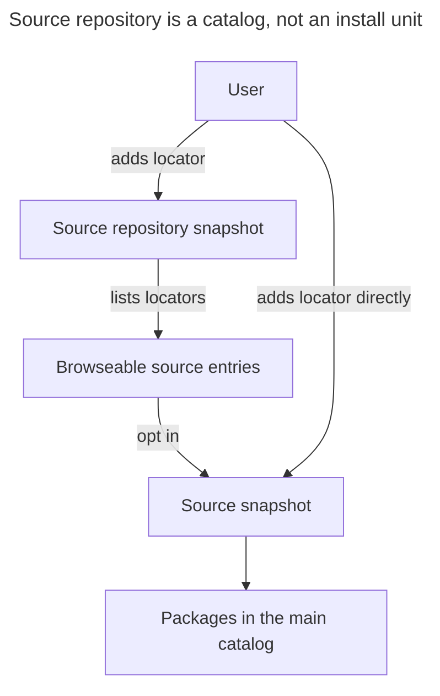

# Source repositories and artifact locators

Skill Manager today treats a **source** as one Git URL whose default branch publishes `skill-manager.json`. Users add those URLs one at a time. This plan adds a **source repository** (a browseable catalog of sources) and a second **locator** so both a source and a source repository can be fetched from Git or from a raw HTTPS artifact URL (Nexus, GitHub archives, any static host).

## Product decisions

These were confirmed before planning:

| Question                                 | Decision                                                                                                                                   |
| ---------------------------------------- | ------------------------------------------------------------------------------------------------------------------------------------------ |
| What does adding a source repository do? | Browse, then opt in. The catalog is visible; packages appear only after a listed source is added.                                          |
| How is Nexus addressed?                  | Raw HTTPS artifact URL. A source is a zip/tar of the same tree as a Git source. A source repository is a JSON file. No Nexus-specific API. |
| Versions and auth?                       | Always latest, public/anonymous only. Git still follows default-branch HEAD. Artifacts re-fetch the same URL. No credentials, no pins.     |

Out of scope for this cut: stored credentials, HTTP (non-TLS) LAN Nexus, Maven GAV / `maven-metadata.xml`, version pins, auto-subscribe, nested repositories, changing package install/ownership.

## Current seams

Acquisition, identity, and config are Git-shaped end to end:

- `src-tauri/src/sources.rs` — URL canonicalization, `sourceKey = sha256(url without .git)`, `ls-remote HEAD`, sparse clone of `skill-manager.json` then referenced paths.
- `src-tauri/src/source_v1.rs` — `sources.json` v4 stores `{ sourceKey, sourceId, name, description, url }`. Refresh compares the Git commit.
- `src-tauri/src/application_v1.rs` + `ipc_v1.rs` — `prepare_source` / `confirm_source` take a URL string.
- `src/App.tsx` — Manage Sources is one Git URL field. Catalog groups by `sourceKey`.
- Ledger `InstallationRecord.source_url` + `commit` — provenance only; ownership authority is still `sourceKey`.
- Built-in Skillbook is the Git URL `https://github.com/jacobragsdale/skillbook` with a frozen `sourceKey`. **That hash formula must not change.**

After a successful fetch, Git metadata is stripped and the validated tree is the snapshot. Artifact acquisition must produce the same kind of tree so catalog, planner, and executor stay unchanged.

## Domain model

Retire the docs habit of calling a source Git clone a "source repository". New terms:

- **Source** — a tree with top-level `skill-manager.json` (unchanged v2 packages).
- **Source repository** — a catalog document that _lists_ sources. It is not installable and does not contribute packages by itself.
- **Locator** — how to fetch either one: `git` or `artifact`.
- **Revision** — Git commit SHA, or SHA-256 of the downloaded artifact bytes. Both already fit `valid_commit_sha` (40 or 64 lowercase hex), so `current.json` can keep storing the token in `commit`.



Adding a repository never writes `sources[]`. Removing a repository never uninstalls opted-in sources. A listing change on refresh updates the browse list only.

## Locator contract

```rust
enum Locator {
    Git { url: String },      // https:// or ssh://, existing rules
    Artifact { url: String }, // https:// only, no userinfo
}
```

**Git** — keep today's canonicalization (scheme, host case, default ports, no credentials, no query/fragment, strip trailing slash, identity key ignores `.git`).

**Artifact** — HTTPS only, no userinfo, fragment stripped, default port 443 omitted, host lowercased. **Query strings are kept** (some raw artifact hosts use them). No `http://`, including LAN Nexus; that waits with credentials.

Identity:

- Git `sourceKey` — **identical** to today (`sha256` of the URL with `.git` stripped). Protects cache dirs, ledger rows, and the built-in Skillbook key.
- Artifact `sourceKey` — `sha256("artifact:" + canonical url)`, still rendered as `source-` + 16 hex chars.
- Repository key — `repo-` + 16 hex chars of `sha256(kind + "\0" + identity key)`.

A Git repo URL and a zip of the same tree are different identities. That matches today's "URL is authority" rule.

Frontend sends `{ kind, url }`. Do not guess from the string. Wrong payload gets a specific error (zip presented as a repository, JSON presented as a source, Git repo that has the other manifest file, etc.).

## Artifact acquisition

Runs on the existing blocking worker threads. Add:

- `reqwest` with `blocking` + `rustls-tls-native-roots`
- `zip`, `tar`, `flate2`

Rules:

- Timeout 120s (same as Git). Follow at most 5 redirects, each HTTPS and credential-free.
- Cap the download at 50 MB. Existing extracted limits stay 50 MB / 2,000 files.
- Source artifacts: zip, tar, or tar.gz, detected by magic bytes (not only the URL suffix).
- Reject zip-slip, absolute paths, `..`, symlinks, and special entries. Then run `validate_catalog_tree`.
- If the archive has exactly one top-level directory and no sibling files, treat that directory as the source root (GitHub `repo-main/` zips and typical Nexus publishes).
- Source-repository artifacts: the HTTP body **is** the JSON document (not wrapped in an archive).
- Revision = SHA-256 of the **downloaded bytes**.
- Refresh: `HEAD` for `ETag` / `Last-Modified`; skip the `GET` when both match the stored validators. If the server sends no validators, `GET` and compare the digest. Store validators on a v2 `current.json` (`revision`, optional `etag`, optional `lastModified`). Git continues to use `ls-remote` and can write v2 with only `revision`.

Latest means "whatever that URL now returns". Publishers who want a moving pointer publish `…/review-latest.zip` or a stable raw path that they overwrite.

## Source-repository manifest

New file name so a Git URL cannot be both things: **`skill-manager-repository.json`**.

Git repository: sparse-checkout that one file, same clone style as sources. Artifact repository: GET the JSON URL.

```json
{
  "version": 1,
  "repository": { "id": "acme", "name": "Acme sources", "description": "Official portable sources." },
  "sources": [
    { "name": "Review workflows", "description": "Review skill and database MCP server.", "locator": { "kind": "git", "url": "https://github.com/acme/review-source.git" } },
    { "name": "Data tools", "description": "Published from Nexus as a zip.", "locator": { "kind": "artifact", "url": "https://nexus.example.com/repository/raw/sources/data-latest.zip" } }
  ]
}
```

Rules, mirroring `skill-manager.json`:

- Unknown fields rejected. Manifest ≤ 1 MB.
- `repository.id` — 2–32, same charset as `source.id` (letter, then lowercase / digits / single hyphens). It does **not** namespace packages.
- `repository.name` / `description` — same length limits as `source.*`.
- Each listed source requires `name`, `description`, and `locator`. Optional `sourceId` is a hint; after opt-in the fetched `skill-manager.json` is authoritative. If the hint disagrees, opt-in fails with a clear error.
- Duplicate locators (after canonicalization) are fatal. Nested repositories are forbidden.
- Cap listed sources at 200.
- Listing metadata is display-only. Installed names, conflicts, and `sourceKey` always come from the opted-in source.

Generate `schemas/v1/source-repository.schema.json` from Rust via `generate-schema`, same as the source manifest.

## Configuration

Bump `sources.json` to **v5**. Read v4 by wrapping each `url` as `{ "kind": "git", "url" }` and using an empty `repositories` array. Refuse other versions, same as today.

```json
{
  "version": 5,
  "repositories": [
    {
      "repositoryKey": "repo-…",
      "repositoryId": "acme",
      "name": "Acme sources",
      "description": "Official portable sources.",
      "locator": { "kind": "git", "url": "https://github.com/acme/source-catalog.git" }
    }
  ],
  "sources": [
    {
      "sourceKey": "source-…",
      "sourceId": "review",
      "name": "Review workflows",
      "description": "…",
      "locator": { "kind": "git", "url": "https://github.com/acme/review-source.git" },
      "repositoryKey": "repo-…"
    }
  ]
}
```

`repositoryKey` on a source is optional provenance for the UI ("from Acme sources"). It is cleared in the UI if that repository is no longer configured; the source stays.

Uniqueness: repository keys/ids/locators unique among repositories; source keys/ids/locators unique among sources. A source locator may appear in several catalogs; opt-in is still one configured source.

Cache layout:

```text
cache/skill-manager/
  sources/{sourceKey}/current.json
  sources/{sourceKey}/revisions/{revision}/
  repositories/{repositoryKey}/current.json
  repositories/{repositoryKey}/revisions/{revision}/
```

Ledger stays v4. Keep `source_url` as the locator URL and `commit` as the revision token. No ownership migration.

## Application and IPC

Refresh order: repositories first (update browse lists), then sources (existing activate-or-keep-last-good). A repository refresh failure does not block source refresh.

New commands, same prepare/confirm/cancel token pattern as sources:

- `prepare_source_repository` / `confirm_source_repository` / `cancel_prepared_source_repository`
- `remove_source_repository` — drops config + cache only
- `prepare_source` / `confirm_source` gain `{ kind, url }` and optional `repositoryKey`

`AppState` adds `repositories: RepositoryState[]` (id, key, name, description, locator, status, revision, listed sources with `alreadyAdded`). Existing source/item payloads add `locatorKind` so the UI can label Git vs artifact without guessing.

Scheduled sync already refreshes sources; it will refresh repositories in the same lock.

## User interface

Manage Sources becomes two sections:

1. **Source repositories** — kind toggle (Git / Artifact), URL field, list of configured catalogs. Each catalog expands to its listed sources with **Add**. Already-configured locators show as added, not as a second add.
2. **Sources** — same kind toggle for a direct add (today's flow). Each card shows URL, locator kind, and provenance when `repositoryKey` is still present. Remove still plans uninstall of that source's packages.

Main window catalog is unchanged: packages still group by opted-in source. No repository grouping there.

Zod schemas stay `z.strictObject` / discriminated unions, matching `typescript-standards`. Every new IPC payload is parsed from `unknown`.

## Documentation and CLI

Diátaxis split:

| Need        | Change                                                                                                                                                        |
| ----------- | ------------------------------------------------------------------------------------------------------------------------------------------------------------- |
| Tutorial    | New `docs/publish-source-repository.md`. Extend `docs/publish-source.md` with a zip-publish path.                                                             |
| How-to      | Manage Sources copy: add a repository, browse, opt in; add a source from a raw HTTPS zip.                                                                     |
| Reference   | New `docs/source-repository-reference.md`. Update `docs/manifest-reference.md` identity/locator notes.                                                        |
| Explanation | Update `docs/architecture.md` acquisition section. Add `docs/decisions/0002-source-repositories-and-locators.md`. New `docs/diagrams/source-acquisition.mmd`. |

Website: `website/source-manifest.html` must stop saying a compatible source is only a Git repo. Add a sibling page for the repository manifest.

`validate-source` keeps validating a source (path, Git URL, or artifact URL). Add `validate-source-repository` for the catalog document. `generate-schema` writes both schema families.

## Implementation phases

Work in this order so each step stays reviewable and Git sources keep working.

### 1. Locator + `sources.json` v5 (Git-only behavior)

- New `locator.rs`: `Locator`, canonicalize, identity keys, Git sourceKey golden tests against today's hashes (including Skillbook).
- `ConfiguredSource.url: String` → `locator: Locator` with `url()` accessor so ledger/executor compile without a behavior change.
- v4 → v5 read migration; write v5.
- IPC still accepts a bare URL by treating it as Git, **or** switch call sites in the same phase if the frontend is updated with a default of Git.

### 2. Artifact transport for sources

- New `artifact.rs`: HTTPS GET/HEAD, redirect policy, digest, safe extract, single-directory unwrap.
- `prepare_candidate` dispatches on locator kind. Artifact revision is the payload digest.
- v2 `current.json` with optional validators.
- Tests: zip-slip rejected, path limits, unwrap, digest change triggers refresh, ETag short-circuit. Serve fixtures from a local `std::net` listener rather than a live Nexus.

### 3. Source-repository manifest + acquisition

- New `repository.rs` (schema types + parse/validate) and repository snapshot cache.
- Git and artifact acquisition of `skill-manager-repository.json` / raw JSON.
- `generate-schema` + checked-in `schemas/v1/source-repository.schema.json`.
- Validator binary.

### 4. Browse / opt-in application layer

- Persist `repositories` in `sources.json`.
- Prepare/confirm/remove repository IPC. Opt-in calls the existing source prepare path with the listing locator + provenance.
- Refresh repositories before sources. Removal of a repository does not touch source snapshots or the ledger.

### 5. UI

- Manage Sources two-section dialog, kind toggle, browse list, provenance on source cards.
- Extend Zod `appStateSchema` and related types.

### 6. Docs and website

- ADR 0002, architecture, tutorials, reference, website pages, README links.
- Acquisition diagram at `docs/diagrams/source-acquisition.mmd`.

## Key invariants

- Git `sourceKey` bytes do not change.
- Skill Manager still never executes source content.
- Artifact URLs never carry credentials; no new secret store.
- Failed refresh leaves the last validated snapshot active (sources and repositories).
- Opt-in is explicit. Catalog refresh is not install.
- After opt-in, `skill-manager.json` owns `source.id` / name / packages.

## Verification

- `cargo test --manifest-path src-tauri/Cargo.toml --all-targets` — locator golden tests, extract safety, repository schema, v4 migration, opt-in/remove-repo isolation, Git path regressions.
- `pnpm typecheck && pnpm lint && pnpm format:check && pnpm build`
- `cargo run --manifest-path src-tauri/Cargo.toml --bin generate-schema` and confirm schema diffs are intended.
- Manual: add Git source (existing), add artifact source (local HTTPS fixture or a public zip), add a Git catalog, opt in, remove the catalog and confirm the source remains, Refresh with an unchanged ETag.

The Tauri desktop UI cannot be verified in a browser. Website page edits can.

## Follow-ups (not this work)

- Token / username store for private Nexus and private Git.
- `http://` for RFC1918 Nexus.
- Pin a Git ref or artifact version.
- Maven coordinates and version listing.
- Auto-subscribe or "follow all" on a catalog.
