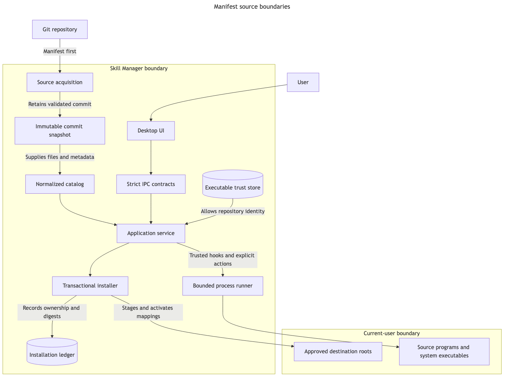

# Backend architecture

Skill Manager keeps repository-controlled input, locally authorized execution, and filesystem ownership in separate boundaries. A source manifest can describe content and programs, but it cannot grant trust or write destinations directly.

[Mermaid source](source-lifecycle.mmd) · rendered with Mermaid CLI 11.16.0

## Identity model

Every configured source carries two identities:

- `sourceId` is the validated manifest namespace. It creates canonical catalog IDs and materialized Agent Skill names.
- `sourceKey` is the canonical-URL fingerprint. It keys caches, trust, ownership, and persisted repository identity.

Keeping them separate prevents a short, reusable display namespace from becoming a security credential. A repository cannot change its namespace during refresh, and a different URL cannot claim an already configured namespace.

## Acquisition and normalization

`source_v1` owns manifest-aware configuration and immutable revision pointers. Validated content lives at `cache/sources/<sourceKey>/revisions/<commit>`, with an atomically replaced `current.json` pointer.

Custom sources use `sources::clone_manifest_source`: a shallow blob-filtered sparse checkout reads only root `skill-manager.json`, validates it, then expands to manifest-referenced globs, mappings, and programs. The built-in source downloads a commit-pinned GitHub archive and reads it twice—manifest discovery first, referenced extraction second.

Both paths enforce the 2,000-file and 50 MB referenced-content limits before `catalog_v1` normalizes the snapshot. Normalization:

- expands Agent Skill and collection globs;
- parses complete Agent Skill YAML metadata;
- creates canonical IDs and effective prefixed names;
- resolves templates and approved destination anchors;
- rejects symlinks, nonportable paths, case collisions, and overlapping ownership roots; and
- records per-entry errors without hiding unrelated valid entries.

The manifest itself is strict Draft 2020-12 data owned by `manifest`. Schemars generates the published schema from the Rust deserialization types; a semantic golden test compares the complete generated and published schemas.

## Application and IPC

`application_v1` is the orchestration boundary. Its operation lock serializes installation, trust, source configuration, cleanup, and synchronization that can mutate installed state. A separate sync lock prevents concurrent refreshes. Filesystem and Git work runs outside the async scheduler on blocking workers.

The service:

- refreshes each source independently and falls back to its last validated snapshot;
- pauses namespace changes or newly introduced executable revisions;
- migrates provably safe legacy Agent Skill installations;
- updates only already-installed, unmodified items; and
- projects configured sources, current entries, retained removed entries, trust, status, destinations, and actions into generic UI state.

`ipc_v1` contains only serialized contracts and thin Tauri adapters. Commands use `sourceId` plus local IDs; contracts also carry the `sourceKey` so the frontend can display the repository-bound state without using it as a command selector. Execution output and scheduled synchronization are typed events. The React frontend validates every response and event with strict Zod schemas before using it.

## Ownership and transactions

`install_v1` is the only declarative destination mutation boundary. `ledger` atomically persists one record per canonical item ID with:

- source key, canonical URL, namespace, and local ID;
- installed commit and item digest;
- materialized Agent Skill name;
- anchored ownership roots and their installed digests;
- lifecycle completion phase; and
- the retained immutable snapshot used for later uninstall.

Install and update run pre-hooks, stage every mapping, move current owned paths aside, activate every new path, and commit the ledger. Any file or ledger failure removes newly activated paths and restores the previous ones. Temporary old content is deleted only after the transaction commits.

An exact unmanaged destination set is adopted by writing the ledger without rewriting content. Differing unmanaged content requires a separate replacement command; every conflicting root is moved to a persistent backup before activation. Symlinks are moved as links, so Skill Manager never writes through them.

Post-hook failure cannot roll back arbitrary external effects safely. Activated files remain, the ledger records an incomplete phase, and retry runs only the pending post-hook. Normal update and uninstall refuse locally modified owned paths.

Source removal is deliberately more destructive. It plans every record and path, requires acknowledgement for modified content, runs uninstall hooks, and deletes owned roots without backup. Only complete success releases source configuration, namespace, trust, and cache.

## Executable boundary

`trust` persists grants separately from source configuration, keyed by canonical URL and source key. A manifest can cause the UI to request trust, but cannot set it. Revocation blocks hooks and actions immediately.

`process` is shared by Git acquisition and trusted manifest commands. It closes standard input, captures and streams bounded output, writes logs, enforces timeouts, terminates process trees, and suppresses Windows console windows. Manifest commands run from their pinned snapshot with reserved identity and anchor environment variables.

No sandbox exists. The process subsystem bounds execution mechanics, not command authority. Source authors remain responsible for idempotence, cleanup, and rollback of opaque side effects.

## Legacy compatibility

The original skill-only `application`, `catalog`, `install`, and `ipc` modules remain private for persisted-state migration and regression coverage. They are not registered on the active Tauri command surface. Their source-aware marker reader supplies evidence used by manifest namespace migration; new installations are ledger-owned.

This compatibility layer can be removed only after supported installations no longer require its cache, configuration, marker, and migration formats.

Debug builds accept `SKILL_MANAGER_QA_ROOT` only when it names a dedicated directory beneath the operating system's temporary directory. Native QA uses that root for every user anchor and Skill Manager state directory; release builds ignore the variable.
